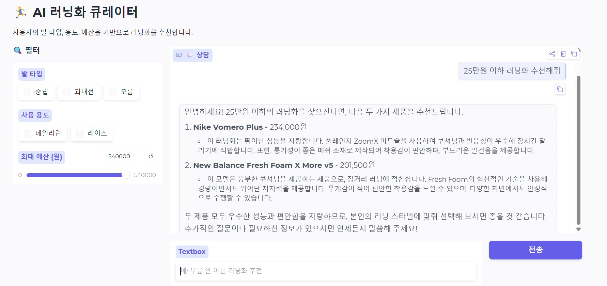

# 🏃‍♂️ AI 러닝화 큐레이터

> 단순 필터 추천 시스템 → Azure 기반 Hybrid AI 검색 시스템으로 확장한 프로젝트

사용자의 자연어 입력(발 타입, 용도, 예산)을 기반으로 GPT + Azure AI Search를 활용해 러닝화를 추천하는 챗봇 시스템입니다.

---

## 📸 데모



---

## ⚙️ 시스템 구조

```
사용자 입력 (한국어)
  → GPT: 한→영 키워드 번역
  → OData 필터 생성 (발타입 / 용도 / 예산)
  → Azure AI Search
       ├── Filter (정확 조건)
       ├── Semantic Search (문장 이해)
       └── Vector Search (의미 유사도)
  → 검색 결과
  → GPT: 추천 이유 한국어 생성
  → Gradio UI 출력
```

---

## 🗂️ 폴더 구조

```
runrepeat-shoe-recommender/
├── data/
│   ├── raw/
│   │   └── RunRepeat_raw.csv              # 원본 스크래핑 데이터
│   └── processed/
│       ├── RunRepeat_final.csv            # verdict/pros/cons 포함 데이터
│       ├── shoes_recommendation_ready.csv # feature 가공 완료본
│       ├── shoes_indexer_ready.csv        # Azure Indexer용 CSV
│       ├── shoes_upload.json              # Azure Search 직접 업로드용
│       └── shoes_recommendation_ready.json
│
├── notebooks/
│   └── RunRepeat.ipynb                    # 전체 개발 과정 (탐색 ~ 완성)
│
├── src/
│   ├── preprocess.py      # feature 변환 (cushion / stability / usage 등)
│   ├── gpt_summarize.py   # verdict+pros+cons → description / review_summary
│   ├── azure_search.py    # Azure AI Search 업로드 및 검색
│   ├── recommender.py     # Hybrid 추천 로직 (번역 → 필터 → 검색 → 생성)
│   └── app.py             # Gradio UI 진입점
│
├── azure/
│   ├── index_schema.json  # Azure AI Search Index 정의
│   ├── skillset.json      # Embedding Skillset 정의
│   └── indexer.json       # Blob → Skillset → Index 파이프라인
│
├── .env.example           # API 키 환경변수 템플릿
├── .gitignore
├── requirements.txt
└── README.md
```

---

## 🚀 실행 방법

### 1. 환경 설정

```bash
git clone https://github.com/your-username/runrepeat-shoe-recommender.git
cd runrepeat-shoe-recommender

pip install -r requirements.txt

cp .env.example .env
# .env 파일에 Azure API 키 입력
```

### 2. 데이터 파이프라인 실행

```bash
# Step 1: GPT 요약 생성 (verdict → description / review_summary)
python src/gpt_summarize.py

# Step 2: Feature 변환 및 업로드용 파일 생성
python src/preprocess.py
```

### 3. Azure AI Search 문서 업로드

```bash
python -c "from src.azure_search import upload_documents; upload_documents('data/processed/shoes_upload.json')"
```

### 4. 앱 실행

```bash
python src/app.py
```

---

## 🔧 기술 스택

| 분류 | 기술 |
|------|------|
| 데이터 | Python, pandas |
| AI 검색 | Azure AI Search (Hybrid: Filter + Semantic + Vector) |
| 언어 모델 | Azure OpenAI GPT-4o-mini |
| UI | Gradio |
| 인프라 | Azure Blob Storage, Azure Cognitive Services |

---

## 📊 데이터 구조

| 컬럼 | 설명 |
|------|------|
| `id` | snake_case 식별자 |
| `name` | 신발 이름 |
| `brand` | 브랜드 |
| `price` | 가격 (원화) |
| `cushion_level` | high / medium / low |
| `stability` | stability / neutral |
| `foot_type` | neutral / flat / high_arch |
| `usage` | race / daily_run / long_run / recovery |
| `wide_fit` | 와이드 핏 여부 |
| `description` | GPT 생성 제품 설명 |
| `review_summary` | GPT 생성 한 줄 평가 |

---

## 🧪 핵심 시행착오

| 문제 | 원인 | 해결 |
|------|------|------|
| 추천이 단순함 | feature 분포 거의 동일 | threshold 재정의 |
| GPT 결과 빈 값 | JSON 파싱 실패 | regex 추출 + fallback |
| 문서 업로드 실패 | `/docs` vs `/docs/index` 혼동 | 올바른 엔드포인트 사용 |
| Azure UI 혼란 | Upload 버튼 없음 | Postman으로 해결 |
| NLP 부족 | 텍스트 필드 없음 | description 컬럼 추가 |

---

## 🔜 확장 방향

- Hybrid Search 고도화 (가중치 튜닝)
- 추천 점수 시스템
- 사용자 피드백 기반 학습
- UI 개선 (카드형 결과)

